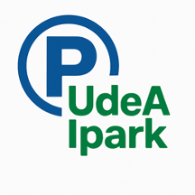
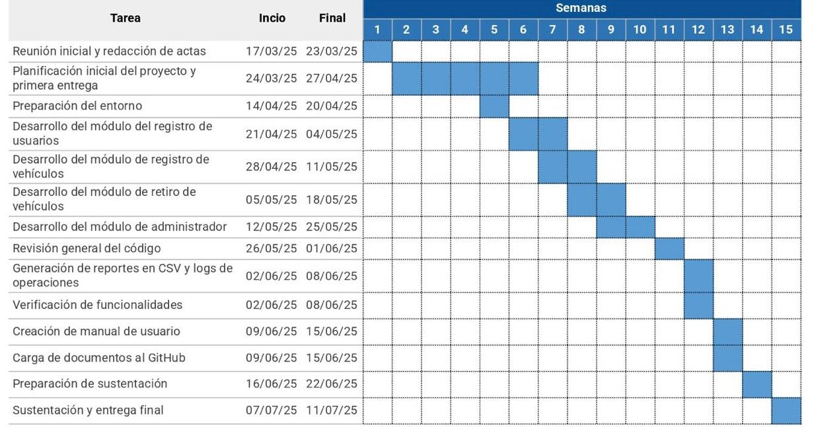

## UdeA Ipark

<a property="dct:title" rel="cc:attributionURL" href="https://github.com/tomasmesaz/parqueadero">UdeA Ipark</a> by <a rel="cc:attributionURL dct:creator" property="cc:attributionName" href="https://github.com/tomasmesaz">Tomás Mesa, Sebastián Ríos, Rebeca Rodríguez</a> is licensed under <a href="https://creativecommons.org/licenses/by-nc/4.0/?ref=chooser-v1" target="_blank" rel="license noopener noreferrer" style="display:inline-block;">CC BY-NC 4.0</a>

Este es un aplicativo de gestión de parqueadero que se plantea como un proyecto integral que abarca desde la evaluación de requisitos hasta la implementación final del sistema. Se llevará a cabo un análisis de las necesidades operativas y administrativas del parqueadero, seguido de la fase de diseño y codificación en Python. El resultado será un programa eficiente y fácil de usar.

---

## ¿Quiénes somos?

Somos un grupo de estudiantes de tercer semestre de Ingeniería Industrial de la Universidad de Antioquia:

- **Tomás Mesa Zuluaga**: Soy una persona organizada, analítica y que busca soluciones prácticas y eficientes a los problemas. Tengo habilidades en programación básica en Python. Me motiva aprender constantemente y aplicar el conocimiento de manera útil y concreta.

- **Sebastián Andrés Ríos Romero**: Me enfoco en lograr resultados, adaptándome fácilmente a lo digital y a los cambios, analizando las situaciones con pensamiento crítico y buscando soluciones prácticas para resolver problemas de forma eficiente.

- **Rebeca Isabel Rodríguez González**: Tengo capacidad de aprendizaje rápido, responsabilidad y facilidad para trabajar en equipo. Me considero una persona organizada, curiosa y con buena actitud frente a los retos. Comprometida con el crecimiento personal y profesional, y motivada a aprender de las diferentes áreas que se nos enseñan en la carrera.

---

## Detalles sobre el proyecto

### Descripción general del software

**iPark** es una aplicación desarrollada en Python, diseñada para gestionar de forma eficiente el funcionamiento de un parqueadero institucional exclusivo para automóviles. El sistema automatiza las tareas operativas clave como el registro de usuarios, el control de ingreso y salida de vehículos, el cálculo automático de tarifas según el tiempo de parqueo y la generación de recibos. Además, cuenta con un módulo administrativo con acceso restringido que permite consultar reportes detallados sobre el uso del parqueadero.

### Objetivos

- Automatizar el control de entrada y salida de vehículos registrados.
- Registrar de forma precisa a los usuarios del parqueadero, garantizando la validez de los datos.
- Calcular de forma automática los cobros con base en el tiempo de permanencia del vehículo y generar recibos/facturas.
- Permitir el acceso a un módulo exclusivo de administración protegido por credenciales que proporcione estadísticas e informes del servicio.
- Minimizar errores humanos en los procesos operativos del parqueadero.

### Beneficios

En primer lugar, mejora la eficiencia al automatizar procesos repetitivos. Asimismo, garantiza la seguridad de los datos, ya que todo el registro de usuarios y transacciones se realiza de forma ordenada y confiable. El sistema también contribuye a una mejor atención al usuario, facilitando el trabajo del personal encargado y permitiendo una operación más fluida y libre de errores. Finalmente, los reportes generados proporcionan un sólido soporte para la toma de decisiones, al permitir analizar el uso del parqueadero teniendo en cuenta datos como, tiempos promedio, registros activos y totales cobrados.

---

## Especificación de requisitos

### Requisitos funcionales

Para satisfacer las necesidades del usuario final el software debe cumplir con:

- Registrar usuarios con validación de nombre, apellido, documento y placa.
- Permitir el ingreso de vehículos registrados y emitir recibo.
- Permitir el retiro de vehículos y calcular el cobro según tiempo de estancia.
- Generar reporte de facturación al momento del retiro.
- Acceso al módulo de administración mediante credenciales. En el módulo de administración se deben mostrar:
  - Total de vehículos registrados.
  - Total de vehículos retirados y no retirados.
  - Total de pagos recibidos.
  - Tiempo promedio de estancia.
  - Vehículo con mayor y menor tiempo de parqueo.
  - Lista completa de usuarios.
  - Exportar reportes en formato CSV.
  - Registrar logs de cada operación con fecha, hora y duración.

### Requisitos no funcionales

- El sistema debe operar de manera ágil, asegurando tiempos de respuesta aceptables que permitan un flujo continuo de operaciones en un entorno de pruebas.
- Se implementará un control básico de acceso para el módulo administrativo mediante autenticación simple (usuario y contraseña).
- La interfaz de consola contará con menús claros e instrucciones sencillas, facilitando la interacción del usuario y la corrección de entradas erróneas.
- Se incluirá un manejo elemental de errores y excepciones, con mensajes informativos que orienten al usuario ante datos inválidos, manteniendo un funcionamiento adecuado en un entorno de prueba académico.

---

## Plan de proyecto

### Cronograma de actividades

### Presupuesto del proyecto

El presupuesto de este proyecto, teniendo en cuenta que el salario mínimo legal vigente en Colombia es de $1.423.500 y que el valor de la hora es de $6.189. Si el grupo estudiante invierte 50 horas de trabajo el presupuesto total será de $309.450. A continuación se hace un desglose por actividad:

| Actividad                                 | Horas estimadas | Costo    |
|------------------------------------------|------------------|----------------|
| Reunión inicial y redacción de actas     | 3 h              | $18.567        |
| Planificación incial del proyecto y primera entrega  | 6 h              | $37.134        |
| Preparación del entorno    | 3 h              | $18.567        |
| Desarrollo de código (módulos principales) | 25 h             | $154.725       |
| Revisión general del código y pruebas             | 5 h              | $30.945        |
| Creación de manual de usuario        | 4 h              | $24.756        |
| Carga de documentos al GitHub            | 2 h              | $12.378        |
| Preparación de sustentación y entrega final             | 2 h              | $12.378        |
| **Total**                                | **50 h**         | **$309.450**   |

---

## Versiones del proyecto

### **Versión 0.1 - Borrador inicial (31 de mayo de 2025)**

**Descripción:**
- Primera versión preliminar del software, desarrollada de manera individual para cada módulo.
- El objetivo principal fue establecer un esquema general del menú y realizar funciones de validación.

**Cambios importantes:**
- Creación de un esquema del menú general.
- Desarrollo inicial de módulos aislados (validación de datos).
- Implementación parcial del módulo de ingreso de vehículos (falta el ingreso de usuario).
- Cálculo preliminar del cobro, pero sin integración.
- El código aún no estaba completamente integrado entre módulos.

### **Versión 0.2 - Mejora en modularización (27 de junio de 2025)**

**Descripción:**
- Mejora en la modularización y la integración de los módulos. 
- El sistema comenzó a ser más cohesivo, aunque aún presentaba errores en la impresión y el estilo.

**Cambios importantes:**
- Se consolidaron los módulos de entrada, validación y administración.
- El código corrió con errores de impresión que fueron identificados.
- Estilo del programa no estaba completamente verificado.
- El módulo de administración fue completado.
- Se definió la forma en la que se almacenarían los datos (consolidación).
- Se integró la generación de facturas, aunque con algunos problemas en el formato de impresión.

### **Versión 0.3 - Pruebas y correcciones iniciales (12 de julio de 2025)**

**Descripción:**
- Se realizaron pruebas y se corrigieron errores menores, con énfasis en el estilo visual y la consistencia en la impresión de datos.

**Cambios importantes:**
- Se corrigieron errores menores relacionados con la impresión de datos y el estilo del programa.
- Se aseguró que el programa tuviera una apariencia consistente y profesional.
- Se verificó la correcta impresión de los datos en las diferentes secciones del sistema.
- Se creó y completó el manual del usuario.

### **Versión Final 1.0 - Versión final actual (15 de julio de 2025)**

**Descripción:**
- Versión definitiva del software para la evaluación final, con todas las funcionalidades completas y funcionales.

**Cambios importantes:**
- Reestructuración interna del código, mejorando su organización y eficiencia.
- Corrección en el cálculo de los vehículos con mayor y menor tiempo de estancia en el parqueadero.
- El software es completamente funcional, permitiendo:
  - Registro de usuarios.
  - Ingreso y retiro de vehículos.
  - Generación de reportes administrativos.
- La integración entre los módulos fue completada, y todas las funcionalidades se probaron con éxito.
- El sistema ahora permite la gestión adecuada de los vehículos y usuarios, y genera reportes correctamente.

