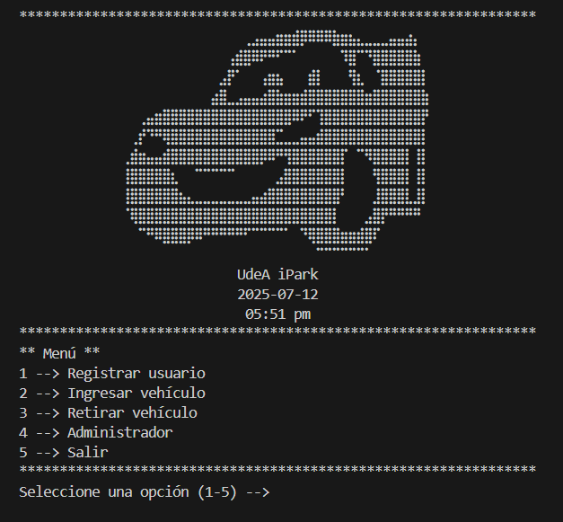

# Manual de usuario - UdeA iPark 

Sistema de gestión de parqueadero

---

## Control de versiones

| Versión | Fecha             | Descripción       | Responsable(s)                      |
|---------|-------------------|-------------------|--------------------------------------|
| 1.0     | 12 de julio de 2025 | Versión inicial del manual | Tomás Mesa, Sebastián Ríos, Rebeca Rodríguez |

---

## Contenido

1. [Introducción](#1-introducción)
2. [Funciones y utilización del sistema](#2-funciones-y-utilización-del-sistema)
3. [Información final](#3-información-final)

---

## 1. Introducción

El presente manual de usuario describe el funcionamiento del sistema UdeA iPark, una aplicación de consola desarrollada en Python para gestionar de manera eficiente un parqueadero universitario. En este documento se explica cómo interactuar con el sistema paso a paso, detallando sus funcionalidades, los requerimientos para su uso, y las instrucciones para realizar correctamente las operaciones disponibles.

UdeA iPark está diseñado para asistir de manera real y estructurada la operación diaria del parqueadero, facilitando el registro de usuarios, el control de ingreso y salida de vehículos, el cálculo de tarifas y la generación de reportes administrativos, todo desde un entorno interactivo por consola.

### 1.1 Objetivo

Brindar a los usuarios una guía práctica y estructurada para el uso correcto del sistema UdeA iPark, detallando sus principales funcionalidades y asegurando una interacción eficiente con el programa.

### 1.2 Alcance

Este manual está dirigido a los usuarios y administradores del sistema UdeA iPark, e incluye las instrucciones necesarias para su correcta operación desde la consola.

### 1.3 Funcionalidad

El programa permite gestionar de forma automatizada un parqueadero universitario a través de una interfaz por consola. Sus funcionalidades principales incluyen:
- Registro de usuarios con validación de nombre, apellido, documento y placa del vehículo.
- Ingreso de vehículos, solo si el usuario está registrado previamente.
- Cálculo del tiempo de parqueo y del valor a pagar según horas y fracciones de hora.
- Generación de recibos al momento del retiro del vehículo.
- Módulo de administración protegido por usuario y contraseña, que permite consultar:
  - Vehículos registrados, retirados y activos.
  - Total recaudado.
  - Tiempo promedio de parqueo.
  - Usuario con mayor y menor tiempo de permanencia.
  - Exportación de reportes en formato CSV.
  
---

## 2. Funciones y utilización del sistema

### 2.1 Prerrequisitos

Entorno del sistema
Sistema operativo compatible: Windows, macOS o Linux.
Python instalado: Versión 3.8 o superior.

Este programa utiliza únicamente librerías estándar de Python, por lo tanto, no es necesario instalar paquetes externos.

El sistema está alojado en GitHub. Puedes clonar o descargar el repositorio desde el siguiente enlace: [GitHub - tomasmesaz/parqueadero](https://github.com/tomasmesaz/parqueadero)

### 2.2 Mapa de navegación

La pantalla principal del sistema, muestra el menú de inicio desde donde el usuario puede acceder a todas las funcionalidades del programa mediante un menú numérico interactivo. Cada opción representa un módulo específico del sistema:

1. Registro de nuevos usuarios  
2. Ingreso de vehículos  
3. Retiro de vehículos  
4. Acceso al panel de administración  
5. Salida del programa

### 2.3 Paso a paso de cada módulo

#### 🔹 Módulo 1: Registrar usuario

Al seleccionar la opción 1 en el menú principal, se ingresa al módulo de Registro de usuario, donde el sistema le pedirá ingresar los siguientes datos:
- Nombre
- Apellido
- Documento de identidad
- Placa del vehículo

Para completar el registro correctamente, asegúrese de:
- Ingresar un nombre y apellido con al menos tres letras, sin números ni símbolos.
- Digitar un documento compuesto solo por números, con una longitud entre 3 y 15 dígitos.
- Escribir una placa de vehículo con el formato correcto: tres letras seguidas de tres números (por ejemplo: ABC123).

Si alguno de los datos no cumple con los requisitos, el sistema mostrará un mensaje de error y deberá volver a intentarlo.

Una vez el registro sea exitoso, podrá proceder con el ingreso del vehículo.

Presione la tecla Enter para salir de este módulo y volver al menú principal.

#### 🔹 Módulo 2: Ingresar vehículo

Al seleccionar la opción 2 en el menú principal, se accede al módulo de Ingreso de vehículo. El sistema solicitará los siguientes datos:

- Documento de identidad del usuario registrado
- Placa del vehículo
  

Si los datos coinciden con un registro existente y hay espacio disponible, el vehículo será ingresado al parqueadero.

A continuación, se mostrará un tiquete en pantalla con la información del ingreso, incluyendo hora, placa, nombre del usuario y número del espacio asignado.

Si no hay espacios disponibles o los datos no coinciden, se mostrará un mensaje de advertencia.

Presione la tecla Enter para salir de este módulo y volver al menú principal.

#### 🔹 Módulo 3: Retirar vehículo

Al seleccionar la opción 3 en el menú principal, se accede al módulo de Retiro de vehículo. Para continuar, el sistema le pedirá:

- Documento del usuario
- Placa del vehículo

  

Asegúrese de ingresar los mismos datos utilizados al momento del ingreso.

Si los datos son correctos, el sistema calculará automáticamente el tiempo que el vehículo estuvo en el parqueadero y mostrará una factura con:

- Datos del usuario
- Tiempo total de permanencia
- Valor a pagar
- Espacio liberado

  

Presione la tecla Enter para salir de este módulo y volver al menú principal.

#### 🔹 Módulo 4: Panel del administrador

Al seleccionar la opción 4 en el menú principal, se accede al módulo de Administrador. El sistema le solicitará un nombre de usuario y una contraseña.

Si los datos ingresados son válidos, se mostrará un menú exclusivo con funciones de consulta para la gestión del parqueadero.

Seleccione la opción deseada según su consulta.

Al seleccionar la opción 1 en el menú del administrador, el sistema muestra el total de vehículos registrados en hasta el momento.

Al seleccionar la opción 2 en el menú del administrador, el sistema muestra el total de vehículos retirados del parqueadero.

Al seleccionar la opción 3 en el menú del administrador, el sistema muestra el total de vehículos que aún no han sido retirados del parqueadero. 

Al seleccionar la opción 4 en el menú del administrador, el sistema muestra el total de dinero recaudado por concepto de parqueo, así como el número de pagos procesados.

Al seleccionar la opción 5 en el menú del administrador, el sistema muestra el tiempo promedio de estancia de los vehículos en el parqueadero, calculado a partir de los registros de ingreso y retiro.

Al seleccionar la opción 6 en el menú del administrador, el sistema muestra la lista completa de usuarios registrados en el parqueadero, junto con su número de documento, nombre completo, placa del vehículo y estado actual (en parqueadero, retirado o solo registrado). 

Al seleccionar la opción 7 en el menú del administrador, el sistema muestra los datos del vehículo con mayor y menor tiempo de parqueo. Para cada caso, se informa la placa, el tiempo total de permanencia, la fecha y hora de ingreso y salida.

Al seleccionar la opción 8 en el menú del administrador, el sistema finaliza la sesión administrativa y retorna al menú principal de UdeA iPark.

Finalmente, presione la tecla Enter para continuar o regresar al menú principal.

---

## 3. Información final

### 3.1 Solución de problemas

#### 🔹 Módulo 1: Registrar usuario

| Mensaje de error | Razón | Solución sugerida |
|------------------|-------|-------------------|
| Error, el nombre es muy corto | El nombre tiene menos de 3 letras | Escriba un nombre con mínimo 3 letras |
| Error, el nombre no debe contener números ni caracteres especiales | El nombre contiene símbolos o números | Ingrese solo letras |
| Error, el nombre no es correcto | El valor ingresado no es texto válido | Asegúrese de digitar un texto válido como nombre |
| Error, el apellido es muy corto | El apellido tiene menos de 3 letras | Escriba un apellido con mínimo 3 letras |
| Error, el apellido no debe contener números ni caracteres especiales | El apellido contiene símbolos o números | Ingrese solo letras |
| Error, el apellido no es correcto | El valor ingresado no es texto válido | Asegúrese de digitar un texto válido como apellido |
| Error, el documento es muy corto o muy largo | El documento tiene menos de 3 o más de 15 caracteres | Ingrese un número de documento entre 3 y 15 dígitos |
| Error, el documento sólo permite números | El documento contiene letras o símbolos | Ingrese solo números |
| Error, el documento no es correcto | El valor ingresado no es texto válido | Asegúrese de digitar un número válido |
| Error, la placa debe tener exactamente 6 caracteres | La placa no tiene 6 caracteres | Asegúrese de que la placa tenga exactamente 6 caracteres |
| Error, la placa debe tener 3 letras y luego 3 números | La placa no cumple con el formato LLLNNN | Ingrese una placa como ABC123 |
| Error, la placa no es correcta | El valor ingresado no es una cadena válida | Verifique que la placa cumpla el formato requerido |
| Error, el documento ya está registrado en el sistema | Documento duplicado | Ingrese uno que no esté registrado |

#### 🔹 Módulo 2: Ingresar vehículo

| Mensaje de error | Razón | Solución sugerida |
|------------------|-------|-------------------|
| Error, el documento no se encuentra registrado en el sistema | Documento no está en la base de datos | Regístrese primero |
| Error, la placa no se encuentra en el sistema | La placa no coincide con la registrada para el documento | Verifique que haya escrito correctamente la placa |
| El parqueadero está lleno. No hay espacios disponibles | Todos los espacios están ocupados | Espere a que se libere un espacio |

#### 🔹 Módulo 3: Retirar vehículo

| Mensaje de error | Razón | Solución sugerida |
|------------------|-------|-------------------|
| Error, el documento no se encuentra registrado en el sistema | El documento no existe en la base de datos | Verifique si el usuario fue registrado e ingresado |
| Error, la placa no se encuentra en el sistema | La placa no coincide con el documento | Ingrese la placa correctamente |
| Favor verificar los datos | Documento o placa inválidos | Revise los datos y vuelva a intentarlo |

####  🔹 Módulo 4: Administrador

| Mensaje de error | Razón | Solución sugerida |
|------------------|-------|-------------------|
| Usuario o contraseña incorrectos | Credenciales inválidas | Verifique que estén bien escritos |
| Opción inválida --> Seleccione 1-8 | Número fuera de rango o caracter inválido | Ingrese solo un número entre 1 y 8 |
| No hay vehículos retirados para calcular promedio | No hay registros de salida | Retire al menos un vehículo antes de usar esta opción |

---
